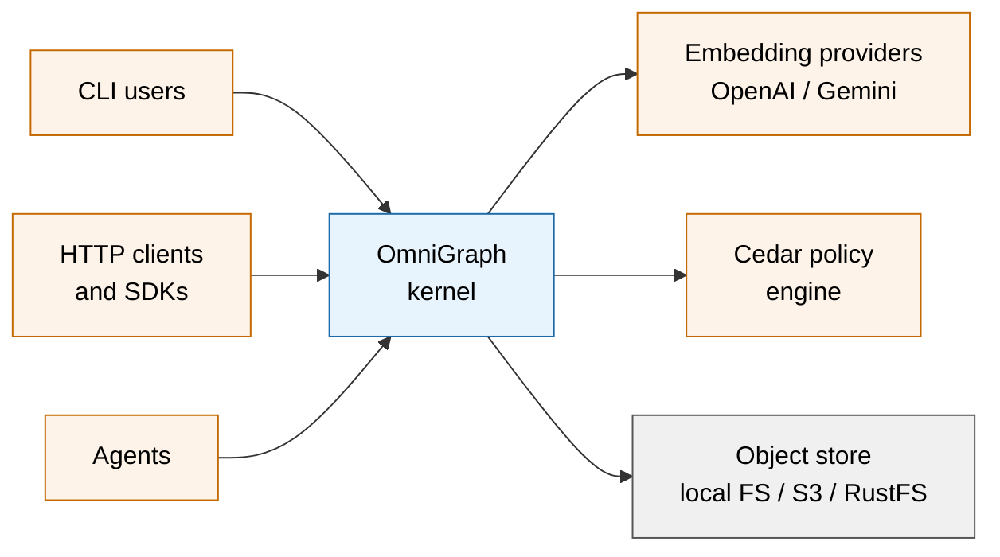
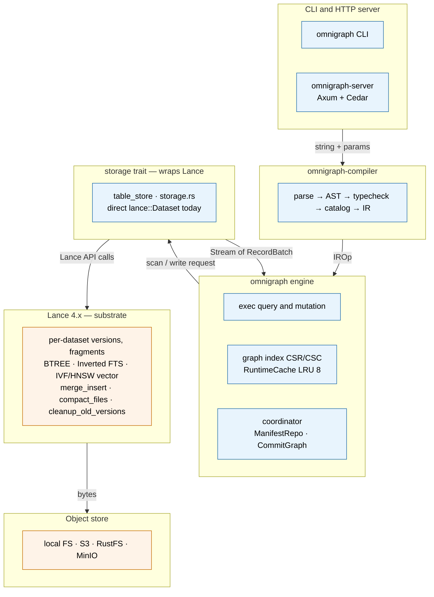
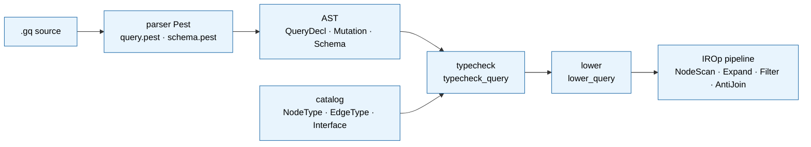
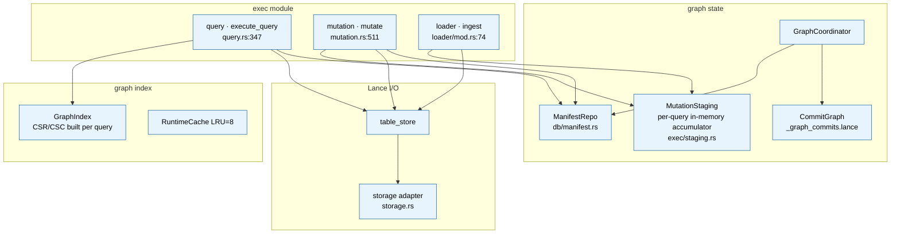
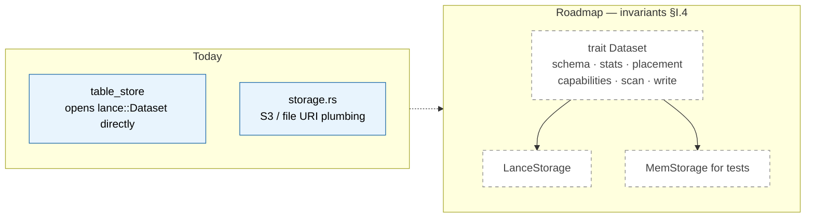
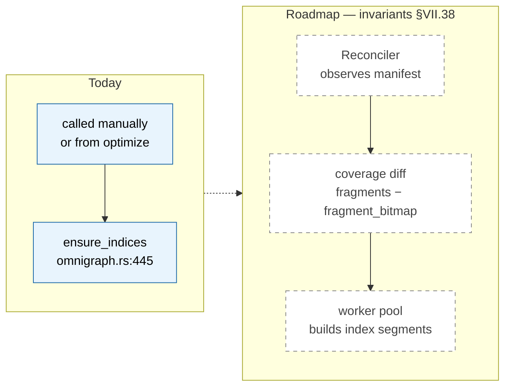

# Architecture

OmniGraph is a typed property-graph engine built as a coordination layer over many Lance datasets, with Git-style branches and commits across the whole graph, multi-modal querying (vector + FTS + BM25 + RRF + graph traversal) in one runtime, an HTTP server with Cedar policy, and a CLI driven by a single `omnigraph.yaml`.

## Reading guide

Three views, increasing zoom:

1. **System context** — what OmniGraph is and what it touches.
2. **Layer view** — the eight-layer stack inside one OmniGraph process.
3. **Component zoom-ins** — what's inside each layer.

For runtime flows (read query, mutation), see [`docs/execution.md`](execution.md). For the on-disk layout of a repo, see [`docs/storage.md`](storage.md).

L1 (orange in the diagrams) is what we inherit from Lance; L2 (blue) is what OmniGraph adds. The L1/L2 framing is also called out in prose at the bottom of this doc.

## System context



OmniGraph runs as a single process (one binary, multiple crates). External dependencies are the embedding APIs (called during ingest and at query-time normalization), Cedar (called for every privileged action), and an object store (everything OmniGraph persists lands here).

## Layer view

Inside the OmniGraph process, work flows through these layers:



The `storage trait` row is partly aspirational. Today the engine calls `lance::Dataset` methods through `table_store`; a capability-bearing `Dataset` trait per [`docs/invariants.md`](invariants.md) §I.4 is on the roadmap (MR-737). The diagram shows the intended seam.

## Component zoom-ins

### Compiler — `omnigraph-compiler`



The compiler crate has zero Lance dependency. It owns the schema language, the query language, and the AST → IR lowering.

Code paths:

- Parser: `crates/omnigraph-compiler/src/query/parser.rs`, `crates/omnigraph-compiler/src/query/query.pest`
- Typecheck: `crates/omnigraph-compiler/src/query/typecheck.rs:83` (`typecheck_query`)
- Lower: `crates/omnigraph-compiler/src/ir/lower.rs:11` (`lower_query`)
- Catalog: `crates/omnigraph-compiler/src/catalog/`

### Engine — `omnigraph` crate



The engine binds the compiler IR to Lance. It owns multi-dataset coordination, the graph topology index, the per-query staging accumulator, and the snapshot/manifest read path.

Code paths:

- Read entry: `Omnigraph::query` at `crates/omnigraph/src/exec/query.rs:7`
- Mutation entry: `Omnigraph::mutate` at `crates/omnigraph/src/exec/mutation.rs:511`
- Manifest commit: `ManifestRepo::commit` at `crates/omnigraph/src/db/manifest.rs:280`
- Graph index: `crates/omnigraph/src/graph_index/`
- Loader: `Omnigraph::ingest` at `crates/omnigraph/src/loader/mod.rs:74`

### Mutation atomicity — in-memory accumulator (MR-794)

Inserts and updates inside `mutate_as` and the bulk loader's
Append/Merge modes go through `MutationStaging`
([`crates/omnigraph/src/exec/staging.rs`](../crates/omnigraph/src/exec/staging.rs)),
a per-query in-memory accumulator. No Lance HEAD advance happens during
op execution; one `stage_*` + `commit_staged` per touched table runs
at end-of-query, then the publisher commits the manifest atomically.

```
op-1 (insert/update) → push RecordBatch → MutationStaging.pending[table]
op-2 (insert/update) → read committed via Lance + pending via DataFusion
                       MemTable (read-your-writes) → push batch
op-N → push batch
─── end of query ───────────────────────────────────────
finalize: per pending table:
   concat batches → stage_append OR stage_merge_insert → commit_staged
publisher: ManifestBatchPublisher::publish (one cross-table CAS)
```

A failed op leaves Lance HEAD untouched on the staged tables: the next
mutation proceeds normally with no drift to reconcile. Concrete
contracts:

- `D₂` parse-time rule: a query is either insert/update-only or
  delete-only. Mixed → reject. Deletes still inline-commit (Lance
  4.0.0 has no public two-phase delete); D₂ keeps the inline path safe.
- `LoadMode::Overwrite` keeps the inline-commit path
  (truncate-then-append doesn't fit the staged shape; overwrite has no
  in-flight read-your-writes requirement).
- Read sites consume `TableStore::scan_with_pending`, which Lance-scans
  the committed snapshot at the captured `expected_version` and unions
  with a DataFusion `MemTable` over the pending batches.

This pattern realizes [docs/invariants.md §VI.25](invariants.md)
(read-your-writes within a multi-statement mutation) and §VI.32
(failure scope bounded) for inserts/updates by construction at the
writer layer. See [docs/runs.md](runs.md) for the publisher CAS
contract this builds on.

### Storage trait — today vs. roadmap



The storage layer's trait surface is aspirational. Today the engine calls `lance::Dataset` methods directly. The roadmap (per [`docs/invariants.md`](invariants.md) §I.4 and MR-737) is a `Dataset` trait that surfaces capabilities and statistics so the planner can reason about pushdown opportunities.

### Index lifecycle — today vs. roadmap



Today, indexes are built explicitly via `ensure_indices`. Reads degrade gracefully when index coverage is partial — Lance's scanner unions indexed and scan paths automatically. The roadmap reconciler (per [`docs/invariants.md`](invariants.md) §VII.38) observes manifest state and converges coverage in the background.

### Server / CLI

```mermaid
flowchart LR
    classDef l2 fill:#e8f4fd,stroke:#1e6aa8,color:#000

    cli[omnigraph CLI<br/>command families]:::l2
    srv_in[Axum HTTP<br/>REST + OpenAPI]:::l2
    auth[Bearer auth<br/>SHA-256 hashed tokens]:::l2
    pol[Cedar policy gate<br/>per request]:::l2
    wl[WorkloadController<br/>per-actor admission]:::l2
    eng[engine API<br/>Arc&lt;Omnigraph&gt;]:::l2
    wq[WriteQueueManager<br/>per-(table, branch)]:::l2

    cli -.-> eng
    srv_in --> auth --> pol --> wl --> eng
    eng --> wq
```

The server applies Cedar policy at the HTTP boundary today (per [`docs/invariants.md`](invariants.md) §VII.45, the roadmap is to push policy into the planner as predicates). After Cedar, mutating handlers go through `WorkloadController` (per-actor admission cap + byte budget; PR 2 / MR-686) before reaching the engine. The engine itself holds an `Arc<WriteQueueManager>` so concurrent mutations on the same `(table, branch)` serialize at the queue, while disjoint keys run in parallel — see [server.md](server.md) "Per-actor admission control" and [runs.md](runs.md). The CLI bypasses the HTTP layer (and admission) and calls the engine API directly.

Code paths:

- Server entry: `crates/omnigraph-server/src/lib.rs`
- Auth: `crates/omnigraph-server/src/auth.rs`
- Policy: `crates/omnigraph-server/src/policy.rs`
- CLI: `crates/omnigraph-cli/src/main.rs`

## L1 / L2 framing

Throughout the docs, capabilities are split into:

- **L1 — Inherited from Lance**: what OmniGraph gets "for free" by sitting on top of the Lance dataset format (columnar Arrow storage, per-dataset versions and branches, index types, `merge_insert`, `compact_files` / `cleanup_old_versions`).
- **L2 — Added by OmniGraph**: typing (schema language), graph semantics, multi-dataset coordination via `__manifest`, graph-level branches and commits, the `.gq` query language and IR, the topology index, the HTTP server, Cedar policy, the CLI.

## Concurrency model

- **MVCC**: every Lance write bumps a per-dataset version; the OmniGraph manifest version coordinates which sub-table versions are visible together.
- **Snapshot isolation**: a query holds one `Snapshot` for its lifetime; concurrent writes don't leak in.
- **Cross-branch isolation**: copy-on-write means readers and writers on different branches don't block each other.
- **Per-query staging**: `mutate_as` and `load` (Append/Merge) accumulate insert/update batches in an in-memory `MutationStaging`; one `stage_*` + `commit_staged` per touched table runs at end-of-query, then the publisher commits the manifest atomically. A mid-query failure leaves Lance HEAD untouched on staged tables. (MR-794; pre-v0.4.0 used a `__run__<id>` staging branch + Run state machine, removed in MR-771.)
- **Schema-apply lock**: `__schema_apply_lock__` system branch serializes schema migrations.
- **Fail-points** (`failpoints` cargo feature): `failpoints::maybe_fail("operation.step")?` in `branch_create`, publish, etc., for deterministic failure injection in tests.

## Workspace crates

- `omnigraph-compiler` — schema and query grammars, catalog, IR, lowering, type checker, lint, migration planner, OpenAI-style embedding client.
- `omnigraph` (engine, published as `omnigraph-engine` on crates.io since v0.2.2) — the Lance-backed runtime: manifest, commit graph, snapshot, exec (incl. per-query `MutationStaging` accumulator), merge, loader, Gemini embedding client.
- `omnigraph-cli` — the `omnigraph` binary.
- `omnigraph-server` — the `omnigraph-server` binary (Axum HTTP server).
